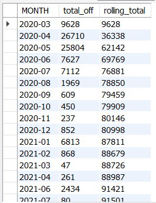
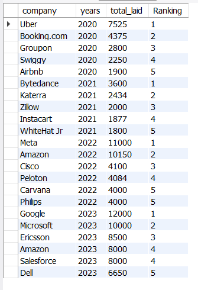
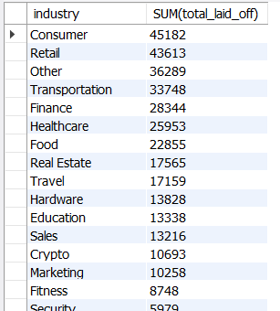
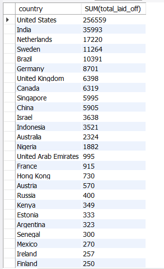

# Global Layoffs SQL Analysis

## Project Overview

This project explores a global layoffs dataset using MySQL.

The project consists of two stages:

1. Data Cleaning
2. Exploratory Data Analysis (EDA)

The objective was to transform the raw dataset into a clean and usable format and then analyze layoff trends across companies, industries, countries, and time periods.

## Tools Used

- MySQL
- SQL
- MySQL Workbench

## Data Cleaning

The dataset was cleaned before performing analysis.

The cleaning process included:

- Created staging tables to preserve the original dataset
- Identified duplicate records using ROW_NUMBER()
- Removed duplicate records
- Standardized inconsistent country values
- Converted the date column to the DATE data type
- Converted blank industry values to NULL
- Populated missing industry values using existing company data
- Removed records where both total layoffs and percentage laid off were missing
- Removed temporary columns used during the cleaning process

## Exploratory Data Analysis

After cleaning the dataset, SQL queries were used to explore:

- Companies with the highest total layoffs
- Industries with the highest total layoffs
- Countries with the highest total layoffs
- Layoffs by year
- Layoffs by company stage
- Companies that laid off 100% of their workforce
- Monthly layoff trends
- Rolling total of layoffs over time
- Top 5 companies by layoffs for each year
- Top 5 industries by layoffs for each year
- Top 5 countries by layoffs for each year

## Key Analysis & Results

> Add the matching screenshots from the `screenshots` folder using the filenames you uploaded to GitHub.

### Monthly Layoffs and Rolling Total



This analysis examines monthly layoffs and uses a CTE with a window function to calculate the cumulative number of layoffs over time.

### Top 5 Companies by Layoffs Each Year



CTEs and `DENSE_RANK()` were used to rank companies by total layoffs within each year.

### Layoffs by Industry



This analysis compares total layoffs across industries to identify which industries recorded the highest total layoffs in the dataset.

### Layoffs by Country



This analysis compares total layoffs across countries in the dataset.

## SQL Concepts Demonstrated

- SELECT
- WHERE
- GROUP BY
- ORDER BY
- Aggregate Functions
- JOINs
- CTEs
- Window Functions
- ROW_NUMBER()
- DENSE_RANK()
- Date Functions
- String Functions
- Data Type Conversion

## Repository Structure

```text
global-layoffs-sql-analysis/
├── raw_data/
├── screenshots/
├── README.md
├── data_cleaning.sql
├── exploratory_data_analysis.sql
└── layoffs_cleaned.csv
```

- `raw_data/` - Original dataset before cleaning
- `screenshots/` - Selected SQL query outputs used in this README
- `data_cleaning.sql` - SQL queries used to clean and standardize the dataset
- `exploratory_data_analysis.sql` - SQL queries used for exploratory analysis
- `layoffs_cleaned.csv` - Cleaned dataset used for analysis

## About

This project was completed as part of my learning in SQL, data analysis, and business analysis.
